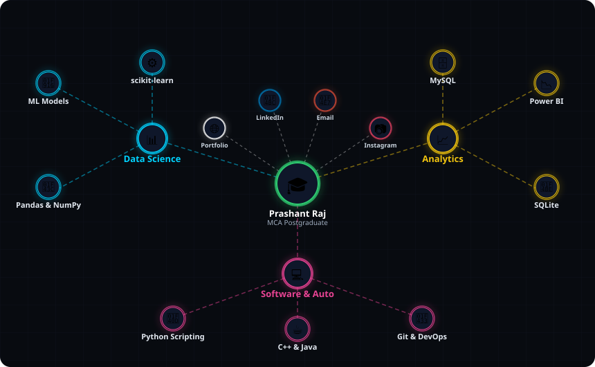
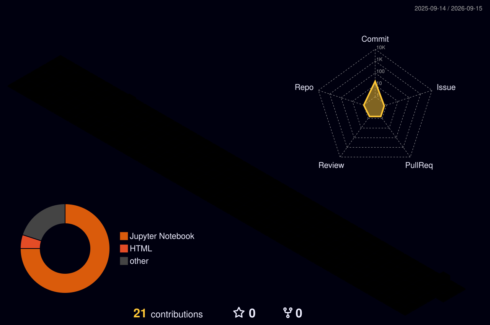

  

<h3 align="center">
  
</h3>

---

### 🌐 My Skills & Connect Network

  

  &nbsp;
  &nbsp;
  &nbsp;
  

---

### 💼 About Me

Driven by data, powered by code, and optimized for scalability. I am a **Master of Computer Applications (MCA)** graduate specializing in building predictive machine learning models, structured data architectures, and automated pipelines. 

I bridge the gap between raw data and business intelligence by combining strong analytical reasoning with modern software engineering practices.

- 🧠 **Solving complex computational problems** with clean, optimized code.
- ⚙️ **Automating repetitive workflows** using intelligent Python scripting.
- 📊 **Crafting interactive dashboards** that tell actionable business stories.
- 🚀 **Exploring cloud solutions** and modern development methodologies.

---

### 🎓 Master of Computer Applications (MCA) Core

*Here is a snapshot of my academic focus and advanced competencies:*

| Domain | Focus Area | Key Concepts / Tools |
| :--- | :--- | :--- |
| **💡 Algorithms & Logic** | Data Structures & Algorithms (DSA) | Object-Oriented Programming, Optimization, Logic Building |
| **🤖 Intelligent Systems** | Machine Learning & Deep Learning | Supervised/Unsupervised Learning, Regression, Classification, scikit-learn |
| **🗄️ Advanced Databases** | Relational & Non-Relational Systems | MySQL, SQLite, Schema Normalization, Query Optimization |
| **🐳 Software Engineering**| Modern Software Architectures | API Basics, MVC Patterns, Python Automation, Git Workflows |

---

### 🕋 3D Contribution Calendar

*Note: Follow the setup instructions below to activate your auto-updating 3D contributions view!*

  

---

### 📊 GitHub Stats

  
  

---

### 🤝 Let's Connect

📫 Reach me via:  
🔗 [**Portfolio Website**](https://prashantraj.vercel.app/)  
💼 [**LinkedIn**](https://www.linkedin.com/in/prashantraj6721/)  
📧 [**Email**](mailto:mrraj6721@gmail.com)  
📷 [**Instagram**](https://www.instagram.com/mr_raj67_/)

---

  

